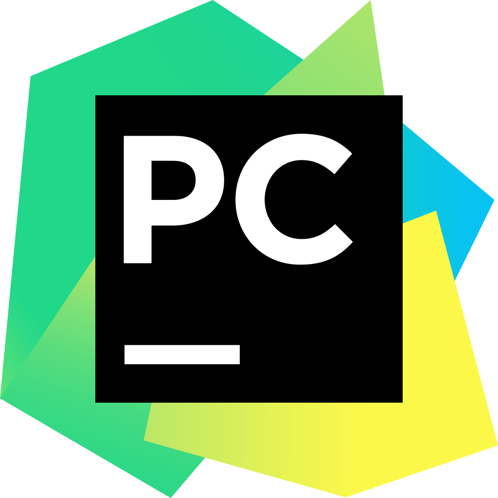
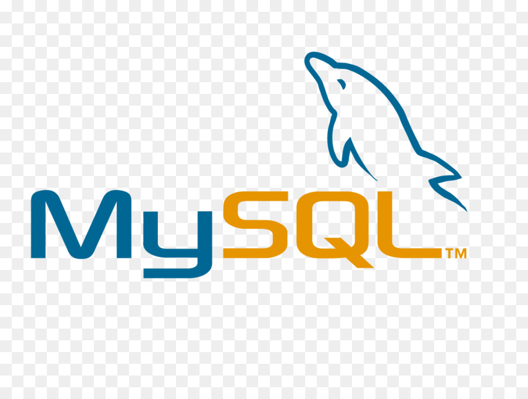

## Hi there 

Myself Abhigyan, I'm a Data Science Researcher!! I spend most of time coding and building outstanding products.

- 🔭 Currently working at **<a href="https://www.insaid.co/">INSAID</a>**.
  
- 🌱 Learning almost everything in Computer Science.
  
- 👯 Looking to collaborate with other content creators.
  
- 🥅 **2021 Goals:** Learn end-to-end Data Science Workflow with model deployment and monitoring. 

 
  
### **Connect With Me**:

 

### **Languages**:

 

### **Tools**:

